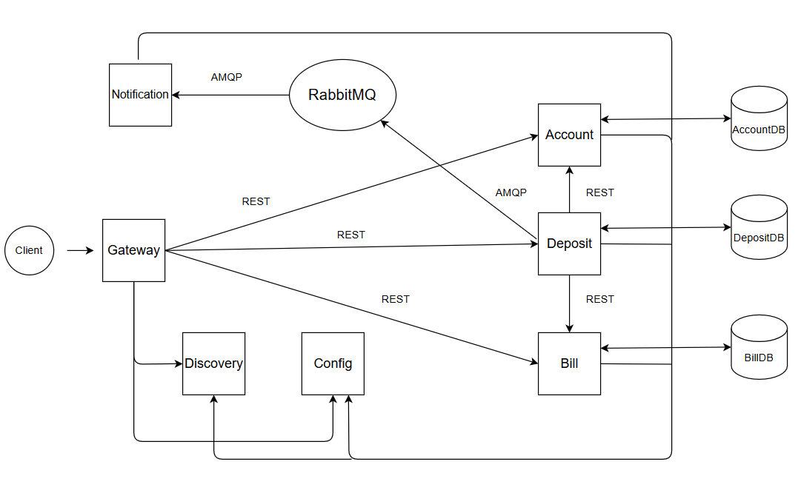

# Микросервисное приложение

## Обзор
Это серверное приложение для работы со своими счетами и депозитами, как аналога интеренет-банка (создание, хранение, 
изменение/пополнение, удаление аккаунтов, счетов и депозитов). Данное приложение разработано с использованием 
микросервисной архитектуры и состоит из нескольких сервисов, которые взаимодействуют для обеспечения функциональности 
управления счетами и депозитами. Включает в себя следующие сервисы:

1. **Config Service** - Управляет конфигурационными свойствами.
2. **Gateway Service** - Является точкой входа для запросов.
3. **Account Service** - Обрабатывает CRUD операции для аккаунта.
4. **Bill Service** - Обрабатывает CRUD операции для счетов.
5. **Deposit Service** - Обрабатывает CRUD операции для депозитов.
6. **Eureka Registry** - Сервер обнаружения для управления микросервисами.
7. **Notification Service** - Сервис получения и отображения/отправления уведомлений от Deposit Service.

## Технологический стек
- **Spring Boot**
- **Spring Cloud**
- **Spring Data JPA**
- **Ribbon (Load balancer)** балансировщик микросервисов
- **Feign (Http client)** клиент для отправки http-запросов
- **RabbitMQ** для отправки сообщений от сервиса
- **Eureka Server**

## Структура

### Сервисы
- **Config Service** - Управляет конфигурацией приложения.
- **Gateway Service** - Обрабатывает входящие запросы и маршрутизирует их к соответствующим микросервисам.
- **Account Service** - Предоставляет функциональность для создания, чтения, обновления и удаления аккаунта.
- **Bill Service** - Предоставляет функциональность для создания, чтения, изменения и удаления счетов.
- **Deposit Service** - Предоставляет функциональность для создания, чтения, пополнения и удаления депозитов.

### Ключевые компоненты
- **AccountController**: Управляет HTTP запросами для аккаунта.
- **BillController**: Управляет HTTP запросами для счета.
- **DepositController**: Управляет HTTP запросами для депозита.
- **AccountService**: Содержит бизнес-логику для работы с аккаунтом.
- **BillService**: Содержит бизнес-логику для работы со счетом.
- **DepositService**: Содержит бизнес-логику для работы с депозитом.
- **FileGateway**: Интерфейс для операций записи файлов с использованием Spring Integration.

### Сущности
- **Account**: Представляет сущность аккаунт с полями, такими как имя, телефон, список счетов и время создания.
- **Bill**: Представляет сущность счет с полями, такими как сумма, разрешен ли овердрафт, является ли счет по 
- умолчанию и время создания.
- **Deposit**: Представляет сущность депозит с полями, такими как сумма, название почты для отправки уведомления и 
- время создания.

### Объекты передачи данных (DTO)
- **AccountDTO**: Используется для передачи данных об аккаунте между клиентом и сервером.
- **BillDTO**: Используется для передачи данных о счете между клиентом и сервером.
- **DepositDTO**: Используется для передачи данных о депозите между клиентом и сервером.

## API Эндпоинты

### AccountController

- **GET `/account/{accountId}`**
    - **Описание:** Получает информацию о счёте по идентификатору.
    - **Параметры:**
        - `accountId` (Long) - ID счёта.
    - **Ответ:**
        - `AccountResponseDTO`.

- **POST `/account`**
    - **Описание:** Создаёт новый счёт.
    - **Тело запроса:**
        - `AccountResponseDTO` - данные нового счёта.
    - **Ответ:**
        - ID созданного счёта (Long).

- **PUT `/account/{accountId}`**
    - **Описание:** Обновляет информацию о счёте.
    - **Параметры:**
        - `accountId` (Long) - ID обновляемого счёта.
    - **Тело запроса:**
        - `AccountResponseDTO` - новые данные счёта.
    - **Ответ:**
        - Обновлённый `AccountResponseDTO`.

- **DELETE `/account/{accountId}`**
    - **Описание:** Удаляет счёт по идентификатору.
    - **Параметры:**
        - `accountId` (Long) - ID счёта для удаления.
    - **Ответ:**
        - Удалённый `AccountResponseDTO`.

---

### BillController

- **GET `/bill/{billId}`**
    - **Описание:** Получает информацию о счёте по идентификатору счёта.
    - **Параметры:**
        - `billId` (Long) - ID счёта.
    - **Ответ:**
        - `BillResponseDTO`.

- **POST `/bill`**
    - **Описание:** Создаёт новый счёт.
    - **Тело запроса:**
        - `BillResponseDTO` - данные нового счёта.
    - **Ответ:**
        - ID созданного счёта (Long).

- **PUT `/bill/{billId}`**
    - **Описание:** Обновляет информацию о счёте.
    - **Параметры:**
        - `billId` (Long) - ID обновляемого счёта.
    - **Тело запроса:**
        - `BillResponseDTO` - новые данные счёта.
    - **Ответ:**
        - Обновлённый `BillResponseDTO`.

- **DELETE `/bill/{billId}`**
    - **Описание:** Удаляет счёт по идентификатору.
    - **Параметры:**
        - `billId` (Long) - ID счёта для удаления.
    - **Ответ:**
        - Удалённый `BillResponseDTO`.

- **GET `/account/{accountId}/bills`**
    - **Описание:** Получает все счета, связанные с заданным счётом.
    - **Параметры:**
        - `accountId` (Long) - ID связанного счёта.
    - **Ответ:**
        - Список `List<BillResponseDTO>`.

---

### DepositController

- **POST `/deposits`**
    - **Описание:** Осуществляет депозит на счёт.
    - **Тело запроса:**
        - `DepositRequestDTO` - данные о депозите.
    - **Ответ:**
        - `DepositResponseDTO`.

## Запуск приложения
1. Запустите сервер Eureka.
2. Запустите Config service.
3. Запустите Gateway service.
4. Запустите Notification service.
5. Запустите Account service.
6. Запустите Bill service.
7. Запустите Deposit service.
8. Открыть приложение в браузере по адресу http://localhost:8765/rest-service**

## Архитектура микросервисов
